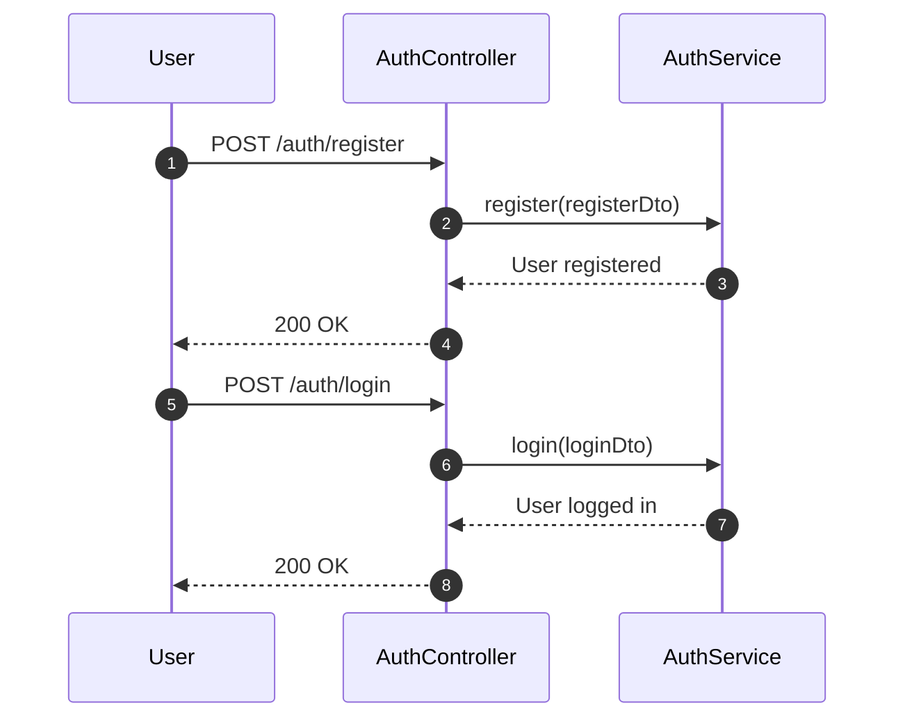
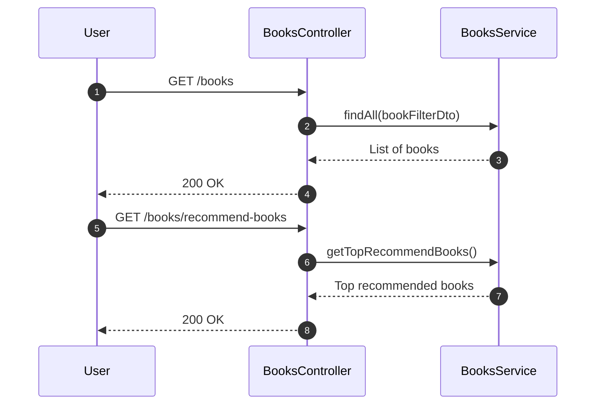
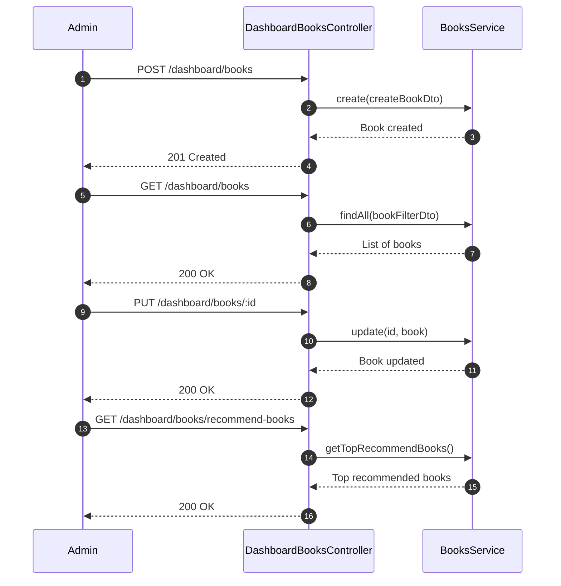
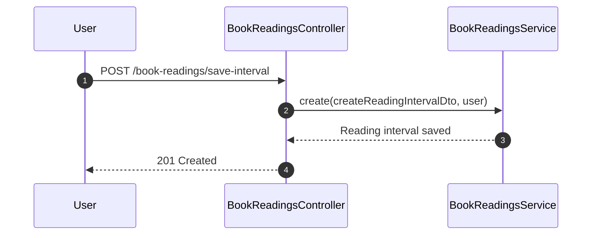

# Reading Recommendation System
This document specifies the requirements for a Reading Recommendation System API. The system allows users to submit their reading intervals and recommends the top-rated books based on the number of unique pages read by all users.

## Sequence Diagrams

### Authentication



### BooksController



### DashboardBooksController



### BookReadingsController



## System Features

### User Authentication
- Register a new user
- Login with existing credentials

### Book Management
- Retrieve a list of all books
- Get top recommended books based on reading intervals

### Admin Dashboard
- Create a new book
- Update existing book details
- Retrieve a list of all books
- Get top recommended books for the dashboard

### Reading Intervals
- Save user reading intervals

## Technologies Used
- **NestJS**: A progressive Node.js framework for building efficient and scalable server-side applications.
- **PostgreSQL**: A powerful, open-source object-relational database system.
- **Jest**: A delightful JavaScript testing framework with a focus on simplicity.
- **Swagger**: A tool for documenting APIs, providing a user interface to interact with the API.
- **Seeding**: Initializing the database with predefined data for testing and development purposes.
- **Docker**: A containerization platform that allows developers to package their applications with all the dependencies they need into lightweight, portable containers.
- **Docker Compose**: A tool for defining and running multi-container applications.
- **Authorization**: Implementing role-based access control to restrict access to certain routes and resources.
- **Authentication**: Implementing JWT-based authentication for secure user sessions.

## Running the Project

### Prerequisites
- Ensure you have Docker and Docker Compose installed on your local machine.

### Cloning the Project
1. Clone the project repository:
    ```sh
    git clone https://github.com/ProgHazem/recommendation-reading-system
    ```
2. Navigate into the project directory:
    ```sh
    cd recommendation-reading-system
    ```

### Using Docker
1. Build and run the Docker containers:
    ```sh
    docker-compose up --build
    ```
    This will create and start three containers: `postgres`, `pgadmin`, and the application container `recomandation_reading`.

### Running Migrations
1. Run the database migrations:
    ```sh
    docker exec -it recomandation_reading bash
    npm run migrate:up
    ```

### Seeding the Database
1. Seed the database with initial data to create an admin user:
    - Email: `admin@admin.com`
    - Password: `Octane@123`
    ```sh
    docker exec -it recomandation_reading bash
    npm run seed
    ```

### Running Tests
1. Run the test suite:
    ```sh
    docker exec -it recomandation_reading bash
    npm run test
    ```

### Running Swagger
1. Open Swagger UI:
    http://localhost:4000/docs

### Running PGAdmin
1. Open PgAdmin UI:
    - Email: `admin@admin.com`
    - Password: `pgadmin4`
    - Link: http://localhost:9090

### File Structure

The main files and directories in the project are structured as follows:
```
recommendation-reading-system/
├── .husky/
├── src/
│   ├── app.module.ts
│   ├── app.controller.ts
│   ├── app.service.ts
│   ├── app.controller.spec.ts
│   ├── main.ts
│   ├── src/
│   │   ├── database
│   │   │   ├── migrations/
│   │   │   │   ├── 1732150162866-AuthModule.ts
│   │   │   │   ├── 1732192765013-create-books.ts
│   │   │   │   └── 1732206640508-createreadingbook.ts
│   │   │   ├── seeder/
│   │   │   │   ├── admins_seeder.ts
│   │   │   │   ├── seed-data.ts
│   │   │   │   ├── seed.helper.ts
│   ├── modules/
│   │   ├── auth/
│   │   │   ├── decorators/
│   │   │   ├── dto/
│   │   │   ├── entities/
│   │   │   ├── enums/
│   │   │   ├── guards/
│   │   │   ├── interfaces/
│   │   │   ├── validators/
│   │   │   ├── auth.controller.ts
│   │   │   ├── auth.controller.spec.ts
│   │   │   ├── auth.service.ts
│   │   │   ├── auth.service.spec.ts
│   │   │   ├── auth.module.ts
│   │   ├── booking-reading/
│   │   │   ├── dto/
│   │   │   ├── entities/
│   │   │   ├── api/
│   │   │   │   ├── book-readings.controller.ts
│   │   │   │   ├── book-readings.controller.spec.ts
│   │   │   ├── book-readings.service.ts
│   │   │   ├── book-readings.service.spec.ts
│   │   │   ├── book-readings.module.ts
│   │   ├── books/
│   │   │   ├── dto/
│   │   │   ├── entities/
│   │   │   ├── interfaces/
│   │   │   ├── api/
│   │   │   │   ├── books.controller.ts
│   │   │   │   ├── books.controller.spec.ts
│   │   │   ├── dashboard
│   │   │   │   ├── books.controller.ts
│   │   │   │   ├── books.controller.spec.ts
│   │   │   ├── books.service.ts
│   │   │   ├── books.service.spec.ts
│   │   │   ├── books.module.ts
│   ├── config/
│   │   ├── configuration.ts
│   │   ├── env.validation.ts
│   │   ├── orm.config.ts
│   │   ├── pino.logger.config.ts
├── test/
│   ├── app.e2e-spec.ts
│   └── jest-e2e.json
├── Dockerfile
├── docker-compose.yml
├── package.json
├── package-lock.json
├── tsconfig.json
├── tsconfig.build.json
├── README.md
├── nest-cli.json
├── jest.config.js
├── commitlint.config.js
├── .prettierrc
├── .npmrc
├── .gitignore
├── eslintrc.js
├── .env.example
├── .dockerignore
```
